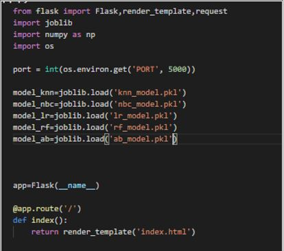
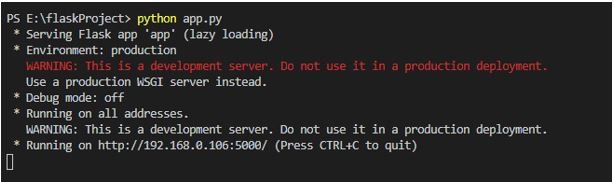
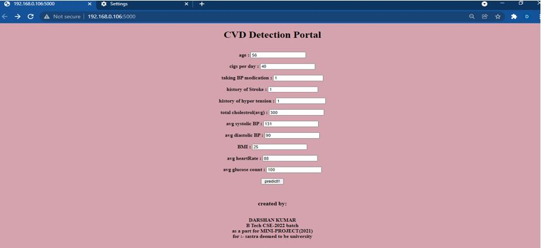
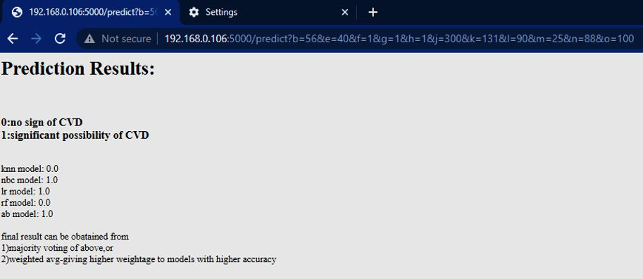
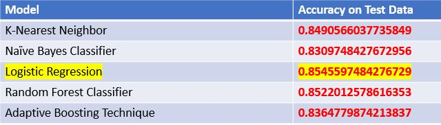

#  Early prediction of heart diseases using ML based Models , their comparison

## <b>1. Abstract </b>
India witnesses 54.5 million cases of CVD(cardio vascular diseases), every year. Most of them are identified, only after
reaching advanced Stage, from which it could not be cured. Tests such as treadmill Test, CT scans, etc. which are used in
western countries, for identifying CVD, are out of reach of Rural parts of India. A ML based Prediction model, is proposed,
as a reliable, accessible, affordable solution.  <b>
 5 state of the art algorithms are proposed:  1)KNN  2) Naïve bayes  3)logistic
regression. 
 Other hybrid algorithms implemented are:  4)Random Forest  5) Adaptive Boosting.</b>   Useful attributes of dataset
were selected, using 1)T-test, 2)co-variance test 3) correlation Test.70% of dataset were used for Training, the rest 30% for
testing. Highest accuracy is given by Logistic Regression, highest sensitivity is given by Naïve Bayes classifier, whereas
Random Forest , shows the highest specificity . Hyper Tuning of Parameters is done , to get highest score, in each model.
Additional algorithms, like Decision Tree, was implemented, to show, how it is likely to overfit, thus not suitable, for this
case. Thus hybrid algorithms like Adaboost, RF were used( decision tree as weak learner), to achieve better performance.
The Trained models were saved in “.pkl” format using “pickle” library. These files are used, to directly employ the trained
model in deployment. The models were deployed using Flask Framework website, for trial. It can be hosted in cloud, for
easy reach, of all primary health centers of rural areas.
## Specific Contribution:
Subroutines of algorithms like KNN, Naïve Bayes, Logistic regression, decision trees ,were implemented from scratch,
without using any pre-defined library functions.
## Specific Learning:
Old age, History of Hyper Tension, presence of high BP, were seen as the most contributing factors for CVD
## Technical Limitations & challenges faced
The accuracy of models, depends on the kind of dataset used.
## <b>2. Implementation using Flask framework </b>
 1. loading trained models 

 2. starting the server 

 3. opening the website in localhost 

 4. Filling appropriate data(with correct datatype) 

 5. The result of models (1= possibility of CVD exists, 0=no such possibility). Final result is obtained by, majority voting by all 5 models. 

 

## <b>3. Comparing Accuracy on Test data </b>

# <b> Created By:</b>
Darshan Kumar 
For 7th semester Mini Project (2021-22) 
B .Tech CSE-SASTRA deemed to be university,thanjavur 

